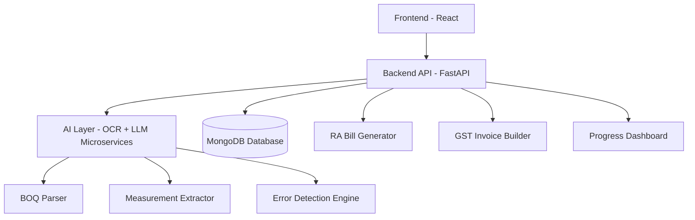
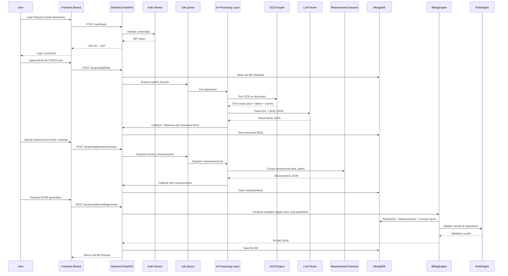

# 🏛️ System Architecture  
**AI-Powered Civil Engineering Billing Automation System**

This document describes the complete system architecture including high-level structure, modules, data models, workflows, and technology decisions.

---

# 1. 🎯 Architectural Goals

- Automate traditional civil engineering billing workflows  
- Modular, scalable, open-source architecture  
- Strong separation of concerns (frontend ↔ backend ↔ AI)  
- AI-powered BOQ parsing & measurement extraction  
- Simple APIs for third-party integrations  
- Robust data models for billing, BOQ, measurement, and project tracking  

---

## 1. 🏗️ High-Level Architecture (Mermaid Flowchart)

```mermaid
flowchart LR
    subgraph Frontend["Frontend (React App)"]
        UI["User Interface"]
        Upload["File Upload Engine"]
        Editor["BOQ and RA Bill Editor"]
        Viewer["Preview and PDF Exporter"]
    end

    subgraph Backend["Backend API (FastAPI)"]
        Gateway["REST API Gateway"]
        Auth["Authentication & JWT Service"]
        BillingEngine["Billing & Orchestration Engine"]
        RuleEngine["Validation & Rule Engine"]
        Logs["Audit Log Service"]
    end

    subgraph AI["AI Processing Layer (Microservices)"]
        OCR["OCR Extraction Service"]
        LLM["BOQ Understanding LLM"]
        MeasureAI["Measurement Extraction Service"]
        ErrorCheck["Error Detection Model"]
    end

    subgraph DB[("MongoDB Cluster")]
        Projects["Projects Collection"]
        BOQs["BOQ Items"]
        RABills["RA Bills"]
        Measurements["Measurements"]
        Invoices["Invoices"]
        Users["Users"]
        LogsDB["Logs and History"]
    end

    UI --> Gateway
    Upload --> Gateway
    Editor --> Gateway
    Viewer --> Gateway

    Gateway --> Auth
    Gateway --> BillingEngine
    Gateway --> RuleEngine
    Gateway --> Logs

    BillingEngine --> OCR
    BillingEngine --> LLM
    BillingEngine --> MeasureAI
    BillingEngine --> ErrorCheck

    Gateway --> DB
    BillingEngine --> DB
    RuleEngine --> DB
    Logs --> LogsDB
```

---

# 3. 🧩 Mermaid Diagram (Live Editable)



---

# 4. 🏗️ Component Breakdown

## 4.1 Frontend (React)
**Responsibilities:**
- Dashboard UI  
- Drag & drop file uploads  
- Interactive BOQ editor  
- RA Bill previews  
- Progress charts  
- Real-time validation visualization  

**Tech Used:**
- React  
- Vite  
- TailwindCSS  
- Zustand / Redux (state management)  
- Axios (API client)

## Component Breakdown Mermaid Graph

```mermaid
graph TD
    subgraph Frontend["Frontend Layer"]
        UI["Dashboard UI"]
        UploadMgr["File Upload Manager"]
        ProjectMgr["Project Manager"]
        BOQEditor["BOQ Editor"]
        RABEditor["RA Bill Editor"]
        InvoiceViewer["Invoice Viewer"]
        PDFPreview["PDF Previewer"]
    end

    subgraph Backend["Backend Layer"]
        APIGateway["API Gateway"]
        Auth["Authentication & JWT"]
        BillingEngine["Billing Engine"]
        RuleEngine["Validation & Rule Engine"]
        BOQManager["BOQ Manager"]
        MeasureManager["Measurement Manager"]
        InvoiceEngine["Invoice Engine"]
        PDFGen["PDF Generator"]
        AuditLog["Audit Logging Service"]
    end

    subgraph AI["AI Processing Layer"]
        OCR["OCR Engine"]
        TableExtract["Table Extraction Module"]
        TextClass["Text Classification Model"]
        BOQLLM["BOQ Understanding LLM"]
        MeasureAI["Measurement Extraction Model"]
        ErrorAI["Error Detection AI"]
    end

    subgraph DB["Database Layer (MongoDB)"]
        Users["Users Collection"]
        Projects["Projects Collection"]
        BOQs["BOQ Items"]
        Bills["RA Bills"]
        Measurements["Measurements"]
        Invoices["Invoices"]
        AILogs["AI Logs"]
    end

    UI --> APIGateway
    UploadMgr --> APIGateway
    ProjectMgr --> APIGateway
    BOQEditor --> APIGateway
    RABEditor --> APIGateway
    InvoiceViewer --> APIGateway
    PDFPreview --> APIGateway

    BillingEngine --> OCR
    BillingEngine --> BOQLLM
    BillingEngine --> MeasureAI
    BillingEngine --> ErrorAI
    BOQManager --> TextClass
    BOQManager --> TableExtract

    APIGateway --> DB
    BillingEngine --> Bills
    RuleEngine --> Bills
    BOQManager --> BOQs
    MeasureManager --> Measurements
    InvoiceEngine --> Invoices
    Auth --> Users
    AuditLog --> AILogs
```



---

## 4.2 Backend (FastAPI)

### Core Responsibilities:
| Module | Purpose |
|--------|---------|
| **Auth Service** | JWT-based authentication & RBAC |
| **BOQ Service** | Parse, store, edit BOQs |
| **Measurement Service** | Extract & validate measurements from documents |
| **Billing Engine** | Generate RA Bills, abstracts, reconciliations |
| **Invoice Engine** | GST-compliant invoice generation |
| **PDF Exporter** | Builds downloadable reports |
| **AI Gateway** | Sends tasks to AI services |

---

## 4.3 AI Processing Layer

A separate module (can be microservice).

### Subcomponents:
### **1. OCR Processor**
- Converts PDF → text + layout  
- Uses Tesseract or custom OCR  

### **2. LLM Pipeline**
- Converts raw BOQ text → structured JSON  
- Applies classification  
- BOQ semantic interpretation  

### **3. Measurement Interpreter**
- Extracts measurements from PDFs  
- Validates formula logic  
- Detects mismatches  

### **4. Error Detection Engine**
- Flags unusual quantities  
- Unbalanced BOQ rates  
- Duplicate entries  
- Contract rule violations  

---

# 5. 🗂️ Database Schema (MongoDB)

## 5.1 User
```json
{
  "name": "John Doe",
  "email": "john@demo.com",
  "role": "billing_engineer",
  "projects": ["project_id"]
}
```

## 5.2 Project
```json
{
  "name": "Highway Project 2025",
  "client": "PWD",
  "boq": ["boq_item_id"],
  "measurements": ["measurement_id"],
  "ra_bills": ["ra_bill_id"]
}
```

## 5.3 BOQ Item
```json
{
  "description": "Earthwork excavation",
  "unit": "cum",
  "quantity": 1500,
  "rate": 120,
  "classification": "Earthwork"
}
```

## 5.4 Measurement Entry
```json
{
  "boq_item_id": "...",
  "dimensions": [
    { "length": 5, "breadth": 4, "height": 3 }
  ],
  "calculated_quantity": 60,
  "source_document": "pdf_url"
}
```

## 5.5 RA Bill
```json
{
  "project_id": "...",
  "bill_number": 3,
  "executed_quantities": [],
  "valuation": 123456,
  "certification_status": "pending"
}
```

## 5.6 Invoice
```json
{
  "bill_id": "...",
  "gst_percent": 18,
  "amount_before_tax": 120000,
  "tax_amount": 21600,
  "total_amount": 141600
}
```

---

# 6. 🔌 API Architecture

## API Service Layer Mermaid Sequence Diagram



### REST API Structure:
```
/auth
/projects
/projects/{id}/boq
/projects/{id}/measurements
/projects/{id}/ra-bills
/invoices
/ai/parse-boq
/ai/measurements
```

### Example: Parse BOQ Endpoint
```http
POST /ai/parse-boq
BODY: { "file": <pdf> }
```

### Example: Generate RA Bill
```http
POST /projects/{id}/ra-bills
```

---

# 7. 🚀 Data Flow (End-to-End)

### **BOQ → Measurement → RA Bill → Invoice**

1. User uploads BOQ PDF  
2. Frontend sends file → Backend  
3. Backend sends file → AI Module  
4. AI parses → structured BOQ JSON  
5. User uploads measurement sheets  
6. AI extracts dimensions & calculates quantities  
7. Backend generates RA Bill  
8. User exports PDF or generates invoice  

---

# 8. 📦 Deployment Architecture

### Supports:
- Docker Compose  
- Microservice-ready AI module  
- Horizontal scaling on backend  
- MongoDB Atlas / self-hosted  

```
+-------------------------+
|     Web Client (UI)     |
+-----------+-------------+
            |
            v
+-------------------------+
|   NGINX / API Gateway   |
+-----------+-------------+
            |
            v
+-----------+-------------+
|      FastAPI API        |
+-------------------------+
|      AI Microservice    |
+-------------------------+
|        MongoDB          |
+-------------------------+
```

---

# 9. 🔮 Future Architectural Expansion

- WebSocket real-time updates  
- Multi-tenant SaaS architecture  
- Plugin ecosystem  
- Mobile scanning app (image → measurement)  
- Vector database for drawing analysis  
- Offline mode (PWA)  

---

# 10. 📘 Summary

The architecture is designed to be:

- Modular  
- Scalable  
- AI-centric  
- Open-source friendly  
- Easy for contributors  